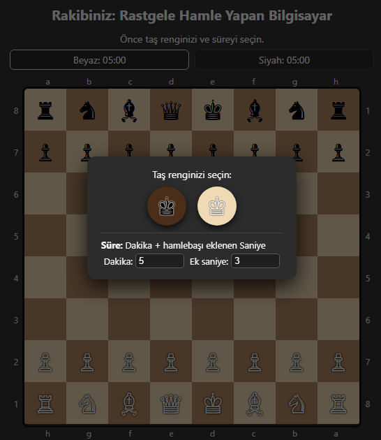
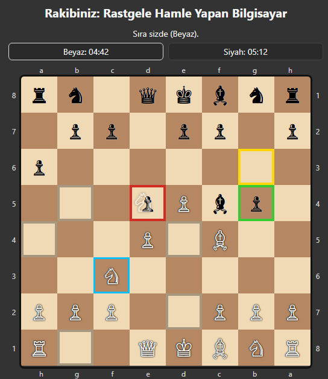
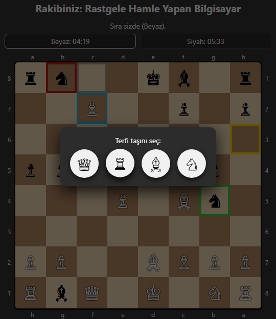

# Browser Chess Game (Vanilla JS)

Bu proje, **harici kütüphane kullanmadan** (pure HTML, CSS ve JavaScript) geliştirilmiş,
tarayıcı üzerinde çalışan bir satranç oyunudur. Oyuncu, rastgele hamle yapan bir bilgisayara
karşı oynar.

---

## 📸 Uygulama Görüntüleri

### Oyun Başlangıcı – Taş ve Süre Seçimi


### Oyun İçi – Hamleler ve Saatler


### Oyun Sonu – Mat / Berabere Ekranı


---

## Özellikler

- ♟️ Tam satranç kuralları
  - Rok
  - Geçerken alma (en passant)
  - Terfi (vezir, kale, fil, at)
  - Mat, pat, 50 hamle kuralı
  - Üç kez tekrar
  - Yetersiz materyal
- ⏱️ Süreli oyun
  - Başlangıç süresi (dakika)
  - Hamle başına ek süre (increment)
  - Süre bitiminde FIDE uyumlu sonuç değerlendirmesi
- 🧠 Bilgisayar rakip
  - Yasal hamleler arasından **rastgele** seçim yapar
- 🖱️ Gelişmiş kullanıcı etkileşimi
  - Tıklama ile oynama
  - Sürükle–bırak (mobil uyumlu, Pointer Events)
- 🔄 Tahta yönü
  - Siyah oynandığında tahta otomatik ters çevrilir
- 📱 Mobil ve masaüstü uyumlu
- 🧩 Tek HTML dosyası
  - Kurulum gerektirmez

---

## Kurulum

Herhangi bir kurulum gerekmez.

1. Depoyu klonlayın veya ZIP olarak indirin
2. `chess-browser.html` dosyasını bir tarayıcıda açın

```bash
git clone <repo-url>
cd <repo-name>
open chess-browser.html

